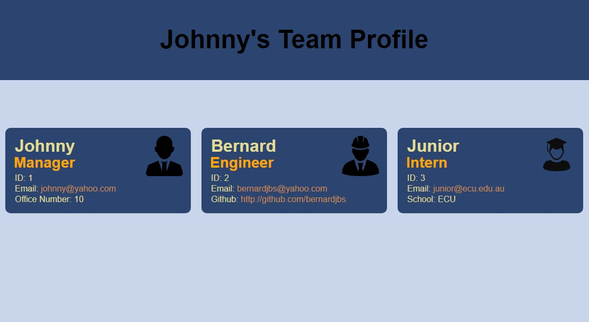

#Team Profile Generator

## Description
This is a command line application using node.js to dynamically generate a team members list of employees, based on user input. 

## Installation 
Packages to install: 

> Inquirer npm
```
> npm install inquirer 
```
> Jest npm
```
> npm install jest
```
## Usage
To get started, run the index.js in the terminal. 
```
> node index.js
``` 
Then follow the prompts accordingly, below is an example:
```
? Please enter Manager's name: Johnny
? Please enter Manager's ID: 1
? Please enter Manager's email address: johnny@yahoo.com
? Please enter Manager's office number: 10
```
Then choose if you want to add a team member to the profile
```
? Do you wish to add another team member? (Y/n)
```
If you choose Yes, you will be prompted with a list of two choices. Engineer or Intern. If you select Engineer, you will be prompted to enter the engineer's details. If you select Intern, you will be prompted to enter the intern's details. 
```
? Please choose your team member's role: (Use arrow keys)
> Engineer
  Intern
```

If you choose No, the app will exit and the team profile will be generated in an HTML file.

To create an Engineer team member, answer the following prompts, below is an example:
```
? Please enter Engineer's name: Bernard
? Please enter Engineer's ID: 2
? Please enter Engineer's email address: bernardjbs@yahoo.com
? Please enter Engineer's github: http://github.com/bernardjbs
```

To create an Intern team member, answer the following prompts, below is an example: 
```
? Please enter Intern's name: Junior
? Please enter Intern's ID: 3
? Please enter Intern's email address: junior@ecu.edu.au
? Please enter Intern's school: ECU
```

To complete the input and generate the HTML file, enter "No" when prompted if you wish to add another team member: 
```
? Do you wish to add another team member? No
Thank you. The HTML file for your team profile has been successfully created.
```

A screenshot of the html page generated: 


## Link video demo
https://drive.google.com/file/d/1grFPibUmWU9fi23EOlAh1MOb5CHzNJeB/view

## Sample HTML file
A sample html file generated by the app: https://bernardjbs.github.io/hw-boot-wk10-Team-Profile-Generator/

